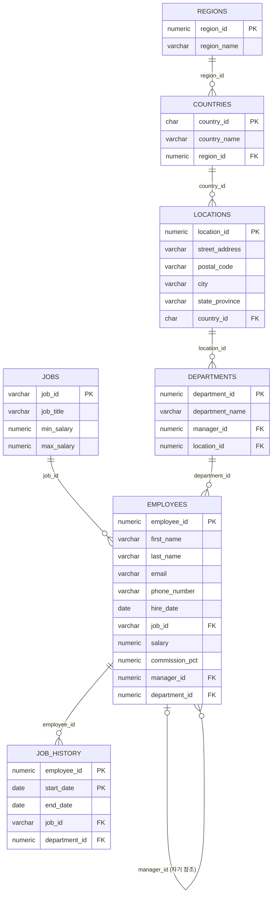

# HR 스키마 ERD 다이어그램

```mermaid
erDiagram
    JOBS {
        varchar job_id PK
        varchar job_title
        numeric min_salary
        numeric max_salary
    }

    DEPARTMENTS {
        numeric department_id PK
        varchar department_name
        numeric manager_id FK
        numeric location_id FK
    }

    EMPLOYEES {
        numeric employee_id PK
        varchar first_name
        varchar last_name
        varchar email
        varchar phone_number
        date hire_date
        varchar job_id FK
        numeric salary
        numeric commission_pct
        numeric manager_id FK
        numeric department_id FK
    }

    JOB_HISTORY {
        numeric employee_id PK
        date start_date PK
        date end_date
        varchar job_id FK
        numeric department_id FK
    }

    LOCATIONS {
        numeric location_id PK
        varchar street_address
        varchar postal_code
        varchar city
        varchar state_province
        char country_id FK
    }

    COUNTRIES {
        char country_id PK
        varchar country_name
        numeric region_id FK
    }

    REGIONS {
        numeric region_id PK
        varchar region_name
    }

    JOBS ||--o{ EMPLOYEES : "job_id"
    DEPARTMENTS ||--o{ EMPLOYEES : "department_id"
    EMPLOYEES ||--o{ JOB_HISTORY : "employee_id"
    EMPLOYEES |o--o{ EMPLOYEES : "manager_id (자기 참조)"
    LOCATIONS ||--o{ DEPARTMENTS : "location_id"
    COUNTRIES ||--o{ LOCATIONS : "country_id"
    REGIONS ||--o{ COUNTRIES : "region_id"
```
