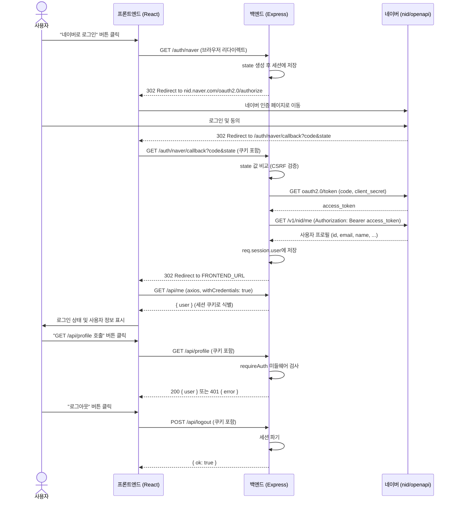

# social-auth

네이버 아이디로 로그인(OAuth 2.0 authorization code grant)의 동작 원리를 확인하기 위한 최소 예제입니다.

## DEMO

- Frontend : https://social-auth-fe.vercel.app
- Backend : https://social-auth-be.vercel.app

## 기술 스택

- 백엔드: Express, express-session (인가 코드 → 액세스 토큰 교환, 프로필 조회, 세션 저장)
- 프론트엔드: React 19 + Vite + axios (`withCredentials: true`로 세션 쿠키 포함)

## 사전 준비: 네이버 애플리케이션 등록

1. [네이버 개발자센터](https://developers.naver.com/apps)에서 애플리케이션 등록
2. 사용 API에 "네이버 로그인" 추가
3. 서비스 URL: `http://localhost:8080`
4. 네이버 로그인 Callback URL: `http://localhost:3000/auth/naver/callback`
5. 발급된 Client ID / Client Secret을 `backend/.env`에 입력

## 실행 방법

```bash
# 백엔드
cd backend
npm install
cp .env.example .env   # NAVER_CLIENT_ID, NAVER_CLIENT_SECRET 입력
npm run dev

# 프론트엔드 (다른 터미널)
cd frontend
npm install
cp .env.development.example .env.development   # 개발 환경 (Vite가 dev 모드에서 자동 로드)
npm run dev
```

브라우저에서 `http://localhost:8080` 접속 후 "네이버로 로그인" 버튼을 누릅니다.

## 동작 방식 (인가 코드 그랜트 흐름)

1. `GET /auth/naver` : 서버가 CSRF 방지용 `state` 값을 세션에 저장하고, 네이버 인증 페이지(`nid.naver.com/oauth2.0/authorize`)로 리다이렉트
2. 사용자가 네이버 로그인 및 동의 후, 네이버가 `redirect_uri`(`/auth/naver/callback`)로 `code`, `state`와 함께 리다이렉트
3. `GET /auth/naver/callback` : `state` 값을 세션에 저장된 값과 비교(CSRF 검증) → 일치하면 `code`를 액세스 토큰으로 교환(`nid.naver.com/oauth2.0/token`) → 액세스 토큰으로 프로필 조회(`openapi.naver.com/v1/nid/me`) → 사용자 정보를 세션에 저장 → 프론트엔드로 리다이렉트
4. `GET /api/me`, `POST /api/logout` : 세션 기반 로그인 상태 확인/로그아웃
5. `GET /api/profile` : `requireAuth` 미들웨어로 보호된 API 예시 — 로그인 상태면 사용자 정보를, 로그아웃 상태면 `401`을 반환

클라이언트(브라우저)는 네이버 Client Secret이나 액세스 토큰을 직접 다루지 않고, 토큰 교환은 전부 백엔드에서만 이루어집니다.

### 시퀀스 다이어그램



## 확인해볼 것

- 로그인 후 개발자도구 > Application > Cookies에서 `connect.sid` 쿠키(세션 ID)만 발급되고, 네이버 액세스 토큰은 브라우저에 노출되지 않는 것을 확인해보세요.
- `backend/server.js`의 `/auth/naver/callback`에서 `state` 비교 로직을 주석 처리하면 CSRF 공격에 취약해지는 것을 코드로 확인할 수 있습니다.
- 네트워크 탭에서 `/auth/naver` → 네이버 로그인 페이지 → `/auth/naver/callback` 순서의 리다이렉트 체인을 확인해보세요.
- 로그아웃 상태에서 "GET /api/profile 호출" 버튼을 누르면 `requireAuth`에 막혀 `401`이 반환되는 것을, 로그인 상태에서는 사용자 정보가 반환되는 것을 비교해보세요.

## 환경변수 (development / production)

### backend/.env

| 변수                    | 설명                                                |
| ----------------------- | --------------------------------------------------- |
| `PORT`                  | 백엔드 서버 포트 (기본 3000)                         |
| `NODE_ENV`               | `development`(기본) / `production` — `production`이면 세션 쿠키가 `sameSite:'none', secure:true`로 전환됨(`server.js`) |
| `FRONTEND_URL`          | 로그인 완료 후 리다이렉트할 프론트엔드 주소 (개발: `http://localhost:8080`, 운영: 실제 배포 도메인 https URL) |
| `NAVER_CLIENT_ID`       | 네이버 애플리케이션 Client ID                        |
| `NAVER_CLIENT_SECRET`   | 네이버 애플리케이션 Client Secret                    |
| `NAVER_REDIRECT_URI`    | 네이버 Callback URL (네이버 개발자센터 설정과 동일해야 함, 운영은 https) |

FE/BE가 실제로 다른 도메인(cross-site)으로 배포된다면 `NODE_ENV=production` + HTTPS가 필수입니다(자세한 이유는 아래 "FE/BE가 다른 오리진일 때" 참고).

### frontend/.env.development / .env.production

Vite는 `npm run dev`(development 모드)일 땐 `.env.development`를, `npm run build`(production 모드)일 땐 `.env.production`을 자동으로 읽습니다(코드 분기 불필요, Vite 내장 기능).

| 변수                  | 설명                                    |
| --------------------- | --------------------------------------- |
| `PORT`                | Vite 개발 서버 포트 (기본 8080, 개발 전용) |
| `VITE_API_BASE_URL`   | 프론트엔드가 호출할 백엔드 주소 — 개발: `http://localhost:3000`, 운영: 실제 백엔드 도메인 |

### FE/BE가 다른 오리진일 때

- **개발(localhost 포트만 다름, same-site)**: `NODE_ENV=development` → `sameSite:'lax'`로 충분, HTTP도 가능
- **운영(완전히 다른 도메인, cross-site)**: `NODE_ENV=production` → `sameSite:'none', secure:true`로 자동 전환되며 HTTPS가 필수(`server.js`의 `isProd` 분기, 프록시 뒤라면 `trust proxy` 설정도 함께 적용됨)

## 파일 구조

```
backend/
  server.js       # Express 서버, 네이버 OAuth 라우트, 세션 설정(dev/prod 쿠키 분기)
  .env.example
frontend/
  index.html
  vite.config.js
  src/
    main.jsx
    App.jsx       # 로그인 버튼, 로그인 상태 표시, 로그아웃
    api.js        # axios 인스턴스 (baseURL, withCredentials)
  .env.development.example
  .env.production.example
```

## 액세스 토큰/리프레시 토큰을 저장해야 할까?

이 예제는 학습 목적으로 `access_token`/`refresh_token`을 세션에 저장하고(`backend/server.js`의 `/auth/naver/callback`), 프론트엔드 화면(`user` 정보 하단)에 그대로 출력합니다. 실제 서비스에서 저장 여부는 용도에 따라 달라집니다.

- **로그인 수단으로만 사용할 때**: 네이버 API는 로그인 시점에 프로필을 한 번 조회하는 용도로만 쓰고, 이후 네이버 API를 다시 호출하지 않습니다. 이 경우 세션에는 "로그인했다"는 사실과 프로필 정보(`id, email, name, ...`)만 있으면 충분하며, 토큰을 보관할 필요가 없습니다. 구글/페이스북/네이버 소셜 로그인 버튼이 흔히 이렇게 동작합니다.
- **로그인 이후에도 네이버 API를 계속 호출해야 할 때** (예: 사용자 대신 네이버 카페/블로그 API 호출 등): `access_token`을 세션 또는 DB에 저장해야 합니다. `access_token`은 만료되므로(네이버는 1시간) `refresh_token`도 함께 저장해 `grant_type=refresh_token`으로 재발급받는 로직이 필요합니다. 또한 토큰을 세션에 두면 세션 하이재킹 시 토큰까지 노출되므로, 암호화나 Redis 같은 별도 보안 스토어 사용을 고려해야 합니다.

> ⚠️ 이 예제에서 프론트엔드에 토큰을 그대로 노출하는 것은 토큰 교환/저장 구조를 눈으로 확인하기 위한 학습용 장치입니다. 실제 서비스에서는 토큰을 클라이언트에 절대 노출하면 안 됩니다.

### 네이버 access_token은 왜 JWT가 아닌가?

OAuth 2.0 스펙은 액세스 토큰의 포맷을 규정하지 않으며, JWT로 발급할지 불투명한(opaque) 문자열로 발급할지는 제공자(Authorization Server) 마음입니다.

- **JWT 방식**: 토큰 자체에 클레임(사용자 ID, 만료시간 등)이 서명된 채로 들어있어, 리소스 서버가 별도 조회 없이 서명만 검증하면 됩니다.
- **Opaque 방식** (네이버, 카카오 등): 토큰은 그냥 키 값이고, 실제 정보는 제공자 서버에 저장되어 있습니다. 그래서 리소스 서버가 그 토큰을 들고 다시 제공자에게 "이 토큰이 누구 것이냐"고 물어봐야(introspection) 사용자 정보를 얻을 수 있습니다 — 이 예제가 `access_token`으로 `openapi.naver.com/v1/nid/me`를 호출하는 것이 바로 이 과정입니다.

(참고: 구글은 로그인 신원 확인용 `id_token`은 JWT로 주지만, API 호출용 `access_token`은 네이버처럼 opaque 문자열입니다.)

## 참고

- 세션 시크릿(`social-auth-demo-secret`)은 학습용 예제 값이므로 운영 환경에서는 반드시 환경변수 등으로 교체해야 합니다.
- 세션 저장소는 기본 `MemoryStore`를 사용합니다(운영 환경에는 부적합하며, Redis 등 별도 스토어 사용이 권장됩니다).
