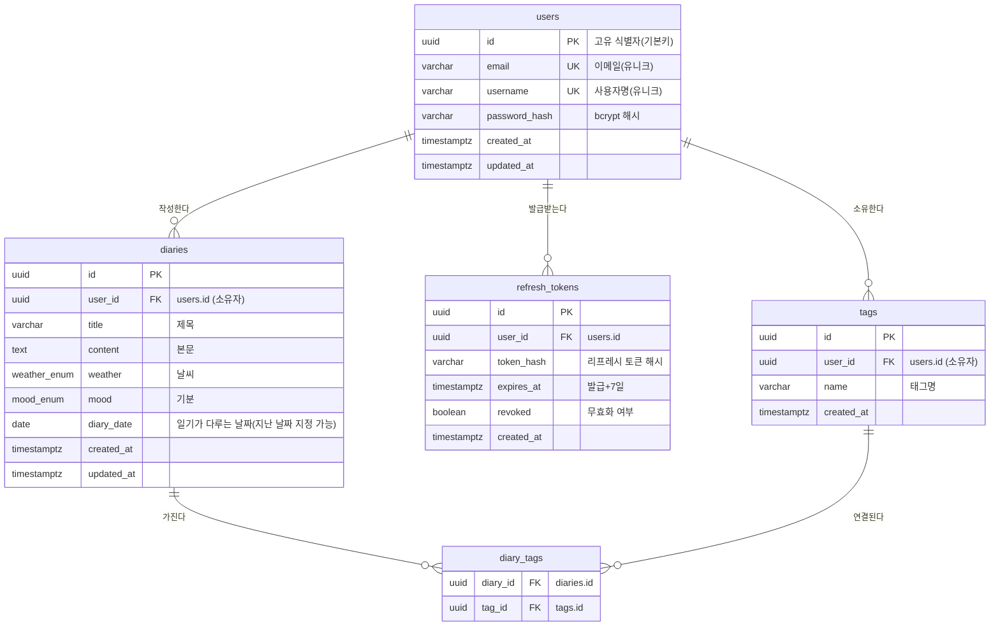

# ERD: 나만의 비밀일기 앱

| 항목 | 내용 |
| --- | --- |
| 문서 버전 | v1.0 |
| 작성일 | 2026-07-05 |
| 대상 DBMS | Supabase PostgreSQL |
| 관련 문서 | [1-prd.md](./1-prd.md) |

> 본 ERD는 [PRD](./1-prd.md)의 요구사항(FR-1 인증/계정, FR-2 일기, FR-3 사용자 정보)을 기반으로 설계했다.

---

## 1. 엔터티 개요

| 엔터티 | 설명 | 근거(PRD) |
| --- | --- | --- |
| `users` | 회원 계정. email·username과 별개의 고유 식별자(UUID) 보유 | FR-1.1, FR-1.2, FR-1.7, FR-3.x |
| `refresh_tokens` | 발급된 Refresh Token 저장·무효화 관리 | FR-1.4, FR-1.5, FR-1.6 |
| `diaries` | 일기 본문. 제목·본문·날씨·기분 + 소유자 | FR-2.1 ~ FR-2.7 |
| `tags` | 태그 마스터(사용자별 태그명 유니크) | FR-2.1, FR-2.7 |
| `diary_tags` | 일기 ↔ 태그 N:M 연결 | FR-2.1, FR-2.7 |

> 날씨(`weather`)와 기분(`mood`)은 별도 테이블 대신 **PostgreSQL ENUM 타입**으로 관리한다. (허용값 검증 용이, PRD 5.1의 값 정의 반영)

---

## 2. ERD 다이어그램 (Mermaid)



---

## 3. 관계(Relationship) 정의

| 관계 | 카디널리티 | 설명 | 삭제 규칙 |
| --- | --- | --- | --- |
| users → diaries | 1 : N | 한 사용자가 여러 일기를 작성 | `ON DELETE CASCADE` (회원 탈퇴 시 일기 삭제) |
| users → refresh_tokens | 1 : N | 한 사용자가 여러 기기/세션 토큰 보유 | `ON DELETE CASCADE` |
| users → tags | 1 : N | 태그는 사용자별로 관리(개인 태그 사전) | `ON DELETE CASCADE` |
| diaries ↔ tags | N : M | 일기 하나에 여러 태그, 태그 하나가 여러 일기에 | 중간 테이블 `diary_tags` |
| diaries → diary_tags | 1 : N | 일기 삭제 시 연결 제거 | `ON DELETE CASCADE` |
| tags → diary_tags | 1 : N | 태그 삭제 시 연결 제거 | `ON DELETE CASCADE` |

> **태그를 사용자별로 두는 이유**: 일기는 본인만 접근하는 프라이빗 데이터이므로(NFR-3), 전역 태그 공유는 불필요하며 사용자별 태그가 프라이버시·단순성 측면에서 적합하다. `tags(user_id, name)` 복합 유니크로 사용자 내 중복을 방지한다.

---

## 4. 테이블 상세

### 4.1 users
| 컬럼 | 타입 | 제약 | 설명 |
| --- | --- | --- | --- |
| id | uuid | PK, default `gen_random_uuid()` | 전용 고유 식별자 (FR-1.2) |
| email | varchar(255) | UNIQUE, NOT NULL | 로그인 식별자 |
| username | varchar(50) | UNIQUE, NOT NULL | 사용자명 |
| password_hash | varchar(255) | NOT NULL | bcrypt 해시 (FR-1.7) |
| created_at | timestamptz | NOT NULL, default `now()` | 가입 시각 |
| updated_at | timestamptz | NOT NULL, default `now()` | 수정 시각 |

### 4.2 refresh_tokens
| 컬럼 | 타입 | 제약 | 설명 |
| --- | --- | --- | --- |
| id | uuid | PK, default `gen_random_uuid()` | |
| user_id | uuid | FK → users.id, NOT NULL | 소유자 |
| token_hash | varchar(255) | NOT NULL | 원문 대신 해시 저장 |
| expires_at | timestamptz | NOT NULL | 발급 + 7일 (FR-1.4) |
| revoked | boolean | NOT NULL, default `false` | 로그아웃/폐기 시 true (FR-1.6) |
| created_at | timestamptz | NOT NULL, default `now()` | |

### 4.3 diaries
| 컬럼 | 타입 | 제약 | 설명 |
| --- | --- | --- | --- |
| id | uuid | PK, default `gen_random_uuid()` | |
| user_id | uuid | FK → users.id, NOT NULL | 작성자(소유자) (FR-2.2) |
| title | varchar(200) | NOT NULL | 제목 |
| content | text | NOT NULL | 본문 |
| weather | weather_enum | NULL 허용 | 날씨 |
| mood | mood_enum | NULL 허용 | 기분 |
| diary_date | date | NOT NULL, default `CURRENT_DATE` | 일기가 다루는 날짜. 사용자가 지난 날짜로 직접 지정 가능(목록 정렬 기준, FR-2.3) |
| created_at | timestamptz | NOT NULL, default `now()` | 실제 작성 시각 |
| updated_at | timestamptz | NOT NULL, default `now()` | |

### 4.4 tags
| 컬럼 | 타입 | 제약 | 설명 |
| --- | --- | --- | --- |
| id | uuid | PK, default `gen_random_uuid()` | |
| user_id | uuid | FK → users.id, NOT NULL | 태그 소유자 |
| name | varchar(20) | NOT NULL | 태그명 (PRD 8: 각 20자 제한) |
| created_at | timestamptz | NOT NULL, default `now()` | |
| | | UNIQUE(user_id, name) | 사용자 내 태그명 중복 방지 |

### 4.5 diary_tags (연결 테이블)
| 컬럼 | 타입 | 제약 | 설명 |
| --- | --- | --- | --- |
| diary_id | uuid | FK → diaries.id, NOT NULL | |
| tag_id | uuid | FK → tags.id, NOT NULL | |
| | | PK(diary_id, tag_id) | 복합 기본키, 중복 연결 방지 |

---

## 5. ENUM 타입 정의 (PRD 5.1 기반)

```
weather_enum : 'sunny' | 'cloudy' | 'rainy' | 'snowy' | 'windy'
mood_enum    : 'happy' | 'neutral' | 'sad' | 'angry' | 'excited' | 'tired'
```

> 라벨(맑음/흐림 등) 표기는 프론트엔드에서 매핑한다. DB는 값(영문 코드)만 저장한다.

---

## 6. 인덱스 설계 (성능 요구 NFR-5, FR-2.7)

| 테이블 | 인덱스 | 목적 |
| --- | --- | --- |
| users | UNIQUE(email), UNIQUE(username) | 로그인/중복 검사 |
| diaries | (user_id, diary_date DESC, created_at DESC) | 내 일기 최신순 목록(FR-2.3) |
| diaries | (user_id, weather) | 날씨 필터(FR-2.7) |
| diaries | (user_id, mood) | 기분 필터(FR-2.7) |
| tags | UNIQUE(user_id, name) | 태그 조회/중복 방지 |
| diary_tags | (tag_id) | 태그 기준 일기 역조회(FR-2.7) |
| refresh_tokens | (user_id), (token_hash) | 토큰 검증/폐기 |

> **작성 일기 수(FR-3.2)** 는 `SELECT count(*) FROM diaries WHERE user_id = ?` 로 조회하며, `(user_id, created_at)` 인덱스로 커버된다.

---

## 7. 무결성 및 보안 규칙 요약

- 모든 자식 테이블은 `user_id`(또는 상위 FK) 기준 `ON DELETE CASCADE` 로 고아 레코드를 방지한다.
- 애플리케이션 계층에서 **모든 일기/태그 조회·수정·삭제 시 `user_id = 요청자` 조건을 강제**하여 타인 데이터 접근을 차단한다(NFR-3, PRD 8 권한 케이스).
- 비밀번호·Refresh Token은 원문이 아닌 해시로만 저장한다(FR-1.7).
- Supabase의 Auth/RLS 기능은 사용하지 않으므로(비목표), 소유권 검증은 백엔드 로직에서 책임진다.

---

## 8. 다음 단계

본 ERD는 `docs/3-supabase-ddl.sql`(실제 `CREATE TABLE`/`ENUM`/인덱스 DDL)의 입력이 된다.
