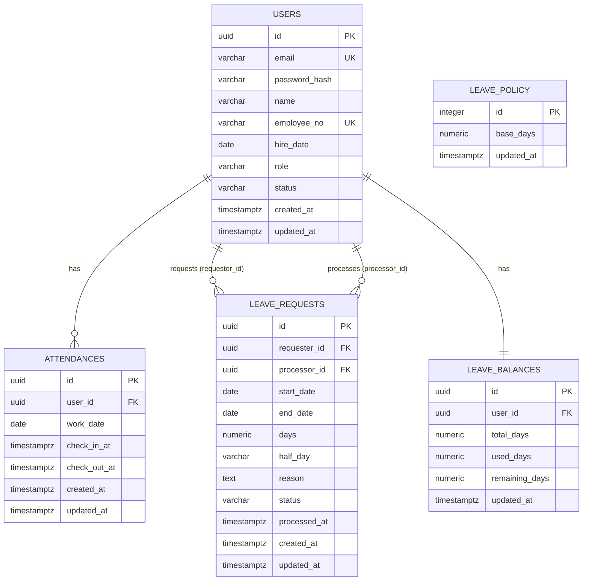

# 소규모 사업장 근태관리 앱 데이터모델/ERD

## 문서 변경 이력

| 버전 | 날짜       | 변경 내용 | 작성자 |
| ---- | ---------- | --------- | ------ |
| 0.1  | 2026-08-19 | 최초 작성 | -      |
| 0.2  | 2026-09-07 | `leave_requests`에 `half_day`(오전/오후 반차) 컬럼 및 관련 CHECK 제약 추가(0.5일 단위 신청 지원) | -      |
| 0.3  | 2026-09-13 | `leave_policy`(전사 공통 연차 정책) 테이블 추가. `leave_balances.total_days` 산정 방식을 실제 구현(입사연도 기준 자동계산)에 맞게 정정 | -      |

## 개요

본 문서는 `1-prd.md`(5.2 비기능 요구사항, 8. 엣지 케이스), `2-user-scenario.md`, `3-wireframe.md`를 근거로 데이터모델과 ERD를 정의한다.

- DB는 Supabase의 PostgreSQL만 사용한다(Supabase Auth 등 부가 기능 미사용). 인증은 자체 구현(JWT)하며 비밀번호는 해시하여 저장한다.
- 최소 엔티티: `users`(사용자), `attendances`(출퇴근 기록), `leave_requests`(연차 신청/승인 이력), `leave_balances`(연차 잔여일수), `leave_policy`(전사 공통 연차 정책, 단일 행).
- 모든 시각 컬럼은 `timestamptz`로 저장하고, 애플리케이션/화면 표시는 Asia/Seoul(KST) 기준으로 변환한다. `timestamptz`는 내부적으로 UTC로 저장되므로 타임존 정보 손실이 없다.
- 사번(`employee_no`)은 유니크 식별자다.

---

## 1. 엔티티 목록

| 엔티티(테이블)   | 설명                                |
| ---------------- | ----------------------------------- |
| `users`          | 사용자(직원/관리자) 계정 정보       |
| `attendances`    | 일자별 출퇴근(체크인/체크아웃) 기록 |
| `leave_requests` | 연차 신청 및 승인/반려 처리 이력    |
| `leave_balances` | 사용자별 연차 잔여일수              |
| `leave_policy`   | 전사 공통 연차 정책(단일 행)        |

---

## 2. 테이블 스키마

### 2.1 `users` (사용자)

| 컬럼명        | 타입         | NULL     | 제약조건/기본값                                           | 설명                            |
| ------------- | ------------ | -------- | --------------------------------------------------------- | ------------------------------- |
| id            | uuid         | NOT NULL | PK, DEFAULT gen_random_uuid()                             | 사용자 식별자                   |
| email         | varchar(255) | NOT NULL | UNIQUE                                                    | 로그인 이메일                   |
| password_hash | varchar(255) | NOT NULL | -                                                         | 해시된 비밀번호(평문 저장 금지) |
| name          | varchar(100) | NOT NULL | -                                                         | 이름                            |
| employee_no   | varchar(50)  | NOT NULL | UNIQUE                                                    | 사번(고유 식별자)               |
| hire_date     | date         | NOT NULL | -                                                         | 입사일                          |
| role          | varchar(20)  | NOT NULL | CHECK (role IN ('manager','employee'))                    | 역할(RBAC)                      |
| status        | varchar(20)  | NOT NULL | DEFAULT 'active', CHECK (status IN ('active','inactive')) | 계정 상태(퇴사 처리 등, PRD 8)  |
| created_at    | timestamptz  | NOT NULL | DEFAULT now()                                             | 생성 시각                       |
| updated_at    | timestamptz  | NOT NULL | DEFAULT now()                                             | 수정 시각                       |

비고: 최초 가입자만 `role='manager'`가 되는 규칙은 "manager 0건 여부" 확인 후 트랜잭션 내에서 결정하는 애플리케이션 로직으로 처리한다(PRD 8, 동시 가입 대응). DB 제약만으로는 "최초 1명"을 강제하기 어려워 애플리케이션 트랜잭션(SERIALIZABLE 또는 행 잠금)과 병행한다.

### 2.2 `attendances` (출퇴근 기록)

| 컬럼명       | 타입        | NULL     | 제약조건/기본값               | 설명                                                     |
| ------------ | ----------- | -------- | ----------------------------- | -------------------------------------------------------- |
| id           | uuid        | NOT NULL | PK, DEFAULT gen_random_uuid() | 출퇴근 기록 식별자                                       |
| user_id      | uuid        | NOT NULL | FK → users(id)                | 대상 사용자                                              |
| work_date    | date        | NOT NULL | -                             | 근무일(체크인 시각 기준으로 확정, KST)                   |
| check_in_at  | timestamptz | NULL     | -                             | 체크인(출근) 시각                                        |
| check_out_at | timestamptz | NULL     | -                             | 체크아웃(퇴근) 시각. 자정을 넘겨도 같은 work_date에 귀속 |
| created_at   | timestamptz | NOT NULL | DEFAULT now()                 | 레코드 생성 시각                                         |
| updated_at   | timestamptz | NOT NULL | DEFAULT now()                 | 레코드 수정 시각                                         |

제약:

- `UNIQUE (user_id, work_date)` — 하루 1회 체크인/체크아웃 원칙(PRD 8: 당일 재체크인 방지)을 DB 레벨에서도 강제. 체크인 시 레코드 1건 생성, 체크아웃은 동일 레코드 UPDATE.
- `CHECK (check_out_at IS NULL OR check_in_at IS NOT NULL)` — 체크인 없이 체크아웃 불가(PRD 8).
- `CHECK (check_out_at IS NULL OR check_out_at >= check_in_at)` — 체크아웃은 체크인 이후 시각이어야 함.

### 2.3 `leave_requests` (연차 신청/승인 이력)

| 컬럼명       | 타입         | NULL     | 제약조건/기본값                                                        | 설명                                                                    |
| ------------ | ------------ | -------- | ---------------------------------------------------------------------- | ----------------------------------------------------------------------- |
| id           | uuid         | NOT NULL | PK, DEFAULT gen_random_uuid()                                          | 연차 신청 식별자                                                        |
| requester_id | uuid         | NOT NULL | FK → users(id)                                                         | 신청자                                                                  |
| start_date   | date         | NOT NULL | -                                                                      | 시작일                                                                  |
| end_date     | date         | NOT NULL | -                                                                      | 종료일                                                                  |
| days         | numeric(4,1) | NOT NULL | CHECK (days > 0)                                                       | 신청 일수(종일 1, 반차 0.5)                                             |
| half_day     | varchar(2)   | NULL     | CHECK (half_day IN ('am','pm'))                                       | 반차 구분(오전/오후). 종일 신청이면 NULL                               |
| reason       | text         | NOT NULL | -                                                                      | 사유                                                                    |
| status       | varchar(20)  | NOT NULL | DEFAULT 'pending', CHECK (status IN ('pending','approved','rejected')) | 대기중/승인됨/반려됨                                                    |
| processor_id | uuid         | NULL     | FK → users(id)                                                         | 처리자(manager)                                                         |
| processed_at | timestamptz  | NULL     | -                                                                      | 처리 시각                                                               |
| created_at   | timestamptz  | NOT NULL | DEFAULT now()                                                          | 신청 생성 시각                                                          |
| updated_at   | timestamptz  | NOT NULL | DEFAULT now()                                                          | 수정 시각                                                               |

제약:

- `CHECK (end_date >= start_date)` — 시작일이 종료일보다 늦을 수 없음(PRD 8).
- `CHECK (requester_id <> processor_id)` — 처리자≠신청자(manager 본인 신청 건 자기 승인 방지, PRD 8). `processor_id`가 NULL인 대기중 상태에서는 자연히 조건을 만족.
- `CHECK ((status = 'pending' AND processor_id IS NULL AND processed_at IS NULL) OR (status IN ('approved','rejected') AND processor_id IS NOT NULL AND processed_at IS NOT NULL))` — 상태와 처리 정보의 정합성(대기중 재처리 방지의 데이터 근거, 실제 재처리 차단은 `status='pending'`일 때만 UPDATE를 허용하는 애플리케이션/쿼리 조건으로 처리).
- `CHECK (half_day IS NULL OR start_date = end_date)` — 반차는 하루짜리 신청에서만 가능.
- `CHECK (half_day IS NULL OR days = 0.5)` — 반차 신청 일수는 항상 0.5로 고정.

비고: PRD 8에 따라 "동일 기간 중복 연차 신청" 검사는 1차 버전 범위에 포함하지 않으므로 겹침 방지 제약(예: EXCLUDE 제약)은 두지 않는다.

### 2.4 `leave_balances` (연차 잔여일수)

| 컬럼명         | 타입         | NULL     | 제약조건/기본값                                     | 설명                                   |
| -------------- | ------------ | -------- | --------------------------------------------------- | -------------------------------------- |
| id             | uuid         | NOT NULL | PK, DEFAULT gen_random_uuid()                       | 잔여일수 레코드 식별자                 |
| user_id        | uuid         | NOT NULL | FK → users(id), UNIQUE                              | 대상 사용자(1인당 1레코드)             |
| total_days     | numeric(4,1) | NOT NULL | DEFAULT 0, CHECK (total_days >= 0)                  | 부여된 총 연차일수(누적)               |
| used_days      | numeric(4,1) | NOT NULL | DEFAULT 0, CHECK (used_days >= 0)                   | 사용(승인 확정)된 연차일수             |
| remaining_days | numeric(4,1) | NOT NULL | GENERATED ALWAYS AS (total_days - used_days) STORED | 잔여 연차일수 = total_days - used_days |
| updated_at     | timestamptz  | NOT NULL | DEFAULT now()                                       | 갱신 시각                              |

제약:

- `CHECK (used_days <= total_days)` — 잔여일수가 음수가 되지 않도록 강제.

비고: 연차는 신청 시점에 잔여일수 초과 여부만 검증(차단)하고, 실제 `used_days` 차감은 승인 시점에 이루어진다(시나리오 3, 4). `total_days`는 배치 스크립트가 아니라 `leave_policy.base_days`와 입사연도를 근거로 애플리케이션 로직(`calcTotalDays`)이 산정한다: 가입 시점에 최초 계산되어 저장되고, manager가 `leave_policy.base_days`를 변경하면 전체 사용자의 `total_days`가 트랜잭션 내에서 즉시 재계산된다(2.5절 참고). 본 문서는 스키마 범위로 계산식 상세는 다루지 않는다.

### 2.5 `leave_policy` (전사 공통 연차 정책)

| 컬럼명     | 타입         | NULL     | 제약조건/기본값                    | 설명                                       |
| ---------- | ------------ | -------- | ----------------------------------- | ------------------------------------------ |
| id         | integer      | NOT NULL | PK, DEFAULT 1, CHECK (id = 1)       | 항상 1건만 존재하는 단일 행(전사 공통 설정) |
| base_days  | numeric(4,1) | NOT NULL | DEFAULT 0, CHECK (base_days >= 0)   | 공통 기본 연차일수(manager가 설정)         |
| updated_at | timestamptz  | NOT NULL | DEFAULT now()                       | 갱신 시각                                  |

비고: 다른 테이블과 FK 관계가 없는 독립된 단일 행 설정 테이블이다. 각 사용자의 `leave_balances.total_days`는 이 값과 `users.hire_date`(입사연도)를 근거로 계산된다:

- 해당연도(올해) 입사자: `0`일 (공통 연차 미적용)
- 전년도 입사자: `base_days` 그대로
- 그 이전 입사자: `base_days + (지난 햇수 - 1)` — 1년 지날 때마다 1일씩 가산

이 계산은 회원가입/관리자 계정 생성 시 최초 1회 수행되고, `base_days` 변경 시 전체 사용자에 대해 재계산된다(백엔드 `utils/leaveAccrual.js`의 `calcTotalDays` 참고).

---

## 3. 관계(FK, 카디널리티)

| 관계                                  | 설명                                             | 카디널리티     |
| ------------------------------------- | ------------------------------------------------ | -------------- |
| users → attendances                   | 한 사용자는 여러 출퇴근 기록을 가진다            | 1:N            |
| users → leave_requests (requester_id) | 한 사용자는 여러 연차를 신청할 수 있다           | 1:N            |
| users → leave_requests (processor_id) | 한 manager는 여러 연차 신청을 처리할 수 있다     | 1:N (nullable) |
| users → leave_balances                | 한 사용자는 하나의 연차 잔여일수 레코드를 가진다 | 1:1            |

`leave_policy`는 다른 테이블과 FK 관계가 없는 독립된 단일 행 설정 테이블이다(2.5절 참고).

---

## 4. ERD (Mermaid)

`LEAVE_POLICY`는 다른 엔티티와 FK 관계가 없는 독립된 단일 행 설정 테이블이라 관계선 없이 표기했다.

---

## 5. 엣지 케이스 ↔ 제약조건 매핑 (PRD 8절 근거)

| PRD 8 엣지 케이스                             | 반영된 스키마 제약                                                                                                                                       |
| --------------------------------------------- | -------------------------------------------------------------------------------------------------------------------------------------------------------- |
| 동일 사번 중복 가입                           | `users.employee_no` UNIQUE                                                                                                                               |
| 당일 이미 체크인한 상태에서 재차 체크인       | `attendances` UNIQUE(user_id, work_date) + 애플리케이션에서 체크인 시 신규 INSERT, 기존 존재 시 409                                                      |
| 체크인 기록 없이 체크아웃 시도                | `attendances` CHECK (check_out_at IS NULL OR check_in_at IS NOT NULL)                                                                                    |
| 자정을 넘겨 근무하는 경우                     | `work_date`는 체크인 시각 기준으로 별도 저장, `check_out_at`은 그대로 timestamptz로 익일 시각 허용(같은 레코드에 귀속)                                   |
| 연차 시작일 > 종료일                          | `leave_requests` CHECK (end_date >= start_date)                                                                                                          |
| 이미 승인/반려된 연차 재처리                  | `status` CHECK + 상태/처리정보 정합성 CHECK, 애플리케이션에서 `WHERE status='pending'` 조건의 조건부 UPDATE로 재처리 차단(경합 시 0 rows affected → 409) |
| manager 본인 신청 연차 자기 승인 시도         | `leave_requests` CHECK (requester_id <> processor_id)                                                                                                    |
| manager가 한 명도 없는 상태(최초 가입자 판별) | DB 제약이 아닌 트랜잭션 내 애플리케이션 로직(“users에 role='manager' 0건인지 확인 후 INSERT”)으로 보장                                                   |
| 퇴사 처리된 사용자의 로그인/접근              | `users.status` CHECK IN ('active','inactive') + 로그인 시 애플리케이션에서 inactive 계정 403 처리                                                        |
| 잔여 연차일수를 초과하는 신청                 | `leave_balances.remaining_days`(GENERATED) 조회 후 애플리케이션에서 신청 시점 400 차단, `used_days <= total_days` CHECK로 최종 정합성 보장               |
| 체크인 후 체크아웃 없이 하루 종료             | `check_out_at` NULL 허용(별도 자동 마감 없음, 1차 버전 정책 그대로 반영)                                                                                 |
| 체크아웃 버튼 재클릭                          | 별도 제약 없음(허용된 정상 흐름). 애플리케이션에서 같은 `attendances` 레코드의 `check_out_at`을 매 호출마다 UPDATE                                       |
| 반차(오전/오후)인데 시작일≠종료일             | `leave_requests` CHECK (half_day IS NULL OR start_date = end_date), CHECK (half_day IS NULL OR days = 0.5)                                              |
