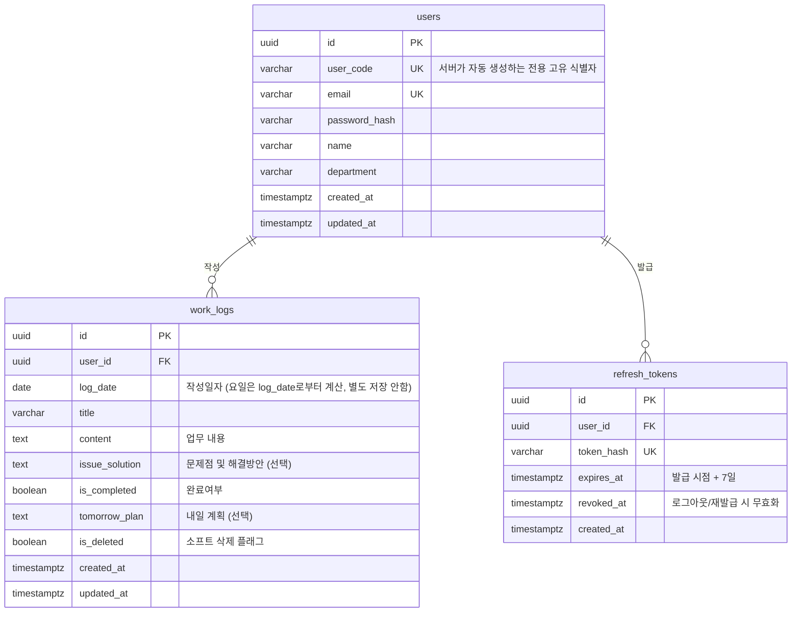

# 업무일지 앱 ERD

`docs/1-prd.md` 기준으로 작성. 데이터베이스는 Supabase PostgreSQL을 사용한다.

## 1. 엔티티 관계도

## 2. 테이블 설명

### 2.1 users (사용자)
| 컬럼 | 타입 | 제약 | 설명 |
|---|---|---|---|
| id | uuid | PK, default gen_random_uuid() | 내부 식별자 |
| user_code | varchar | UNIQUE, NOT NULL | 회원가입 시 서버가 자동 생성하는 전용 고유 식별자 |
| email | varchar | UNIQUE, NOT NULL | 이메일 (로그인 ID) |
| password_hash | varchar | NOT NULL | 패스워드 해시 |
| name | varchar | NOT NULL | 이름 (업무일지 작성자 이름 기본값) |
| department | varchar | NOT NULL | 부서 (업무일지 부서 기본값) |
| created_at | timestamptz | NOT NULL, default now() | 가입일시 |
| updated_at | timestamptz | NOT NULL, default now() | 수정일시 (패스워드 변경 시 갱신) |

### 2.2 work_logs (업무일지)
| 컬럼 | 타입 | 제약 | 설명 |
|---|---|---|---|
| id | uuid | PK, default gen_random_uuid() | 업무일지 식별자 |
| user_id | uuid | FK -> users.id, NOT NULL | 작성자 |
| log_date | date | NOT NULL | 작성일자. 요일은 저장하지 않고 log_date로부터 계산해서 표시 |
| title | varchar | NOT NULL | 제목 |
| content | text | NOT NULL | 업무 내용 |
| issue_solution | text | NULL | 문제점 및 해결방안 |
| is_completed | boolean | NOT NULL, default false | 완료여부 |
| tomorrow_plan | text | NULL | 내일 계획 |
| is_deleted | boolean | NOT NULL, default false | 소프트 삭제 플래그. 삭제 시 행을 지우지 않고 true로 지정, 목록/상세 조회는 이 컬럼이 false인 것만 반환 |
| created_at | timestamptz | NOT NULL, default now() | 작성일시 |
| updated_at | timestamptz | NOT NULL, default now() | 수정일시 (수정/삭제 시 갱신) |

- UNIQUE (user_id, log_date) WHERE is_deleted = false: 삭제되지 않은 업무일지 기준으로 사용자당 하루 1건만 작성 가능 (동일 날짜 중복 작성 방지, PRD 8.엣지케이스 반영). 삭제된 날짜는 재작성 가능
- 모든 조회 쿼리는 `WHERE is_deleted = false` 조건 포함

### 2.3 refresh_tokens (리프레시 토큰)
| 컬럼 | 타입 | 제약 | 설명 |
|---|---|---|---|
| id | uuid | PK, default gen_random_uuid() | 토큰 식별자 |
| user_id | uuid | FK -> users.id, NOT NULL | 소유 사용자 |
| token_hash | varchar | UNIQUE, NOT NULL | Refresh Token 해시값 (원문 저장 금지) |
| expires_at | timestamptz | NOT NULL | 만료 시각 (발급 + 7일) |
| revoked_at | timestamptz | NULL | 로그아웃/재발급 시 무효화 시각 |
| created_at | timestamptz | NOT NULL, default now() | 발급일시 |

- Access Token(12시간)은 서버 저장 없이 JWT 자체 검증만 수행하므로 별도 테이블 없음
- Refresh Token은 재발급/로그아웃 시 즉시 무효화(revoke)할 수 있도록 DB에 저장

## 3. 설계 메모
- "작성한 업무일지 갯수 조회"는 별도 컬럼 없이 `SELECT COUNT(*) FROM work_logs WHERE user_id = ? AND is_deleted = false`로 처리 (PRD 5.1, 소프트 삭제된 건은 제외)
- 사용자별 데이터 격리는 API 레이어에서 `user_id = 로그인 사용자` 조건을 강제하는 방식으로 구현 (PRD 3.3 실패조건 대응)
- 백엔드가 별도로 개발되어 서비스 롤로 DB에 접근하므로 Supabase RLS는 현재 범위에서 적용하지 않음 (추후 프론트에서 Supabase 클라이언트로 직접 접근하는 경로가 생기면 재검토)
